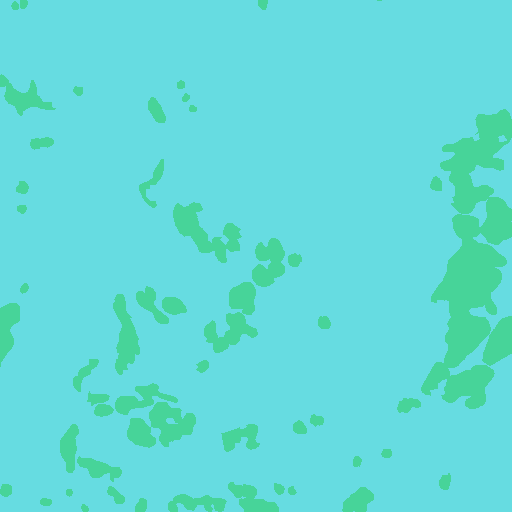
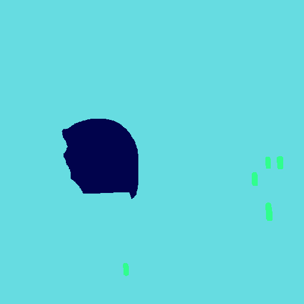
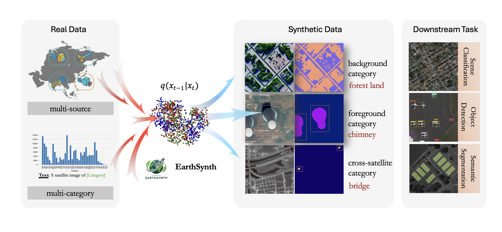
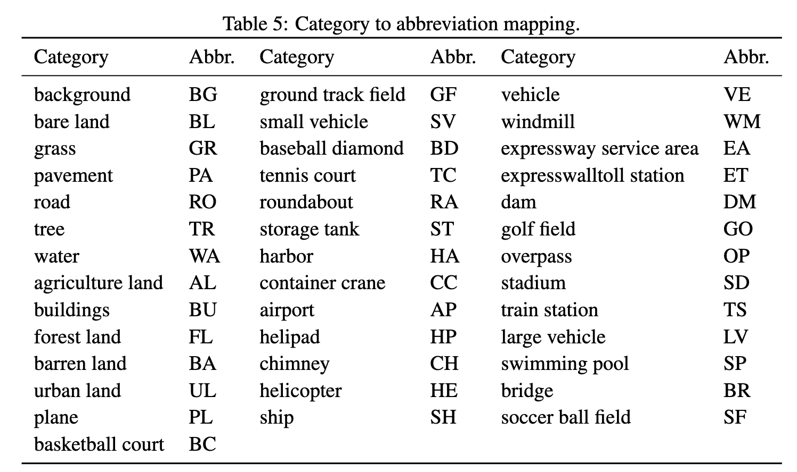
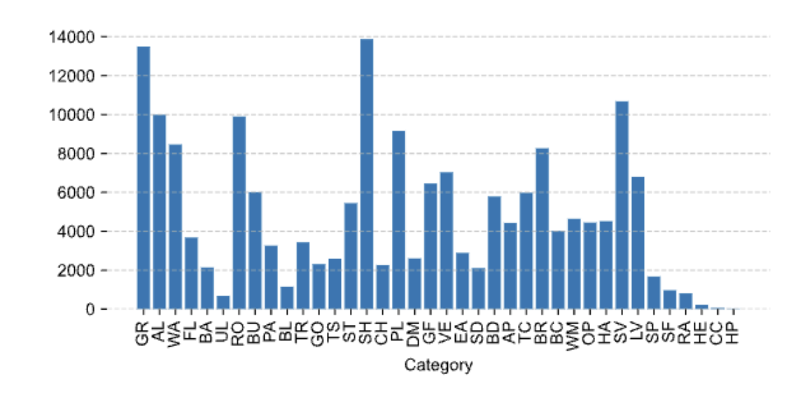
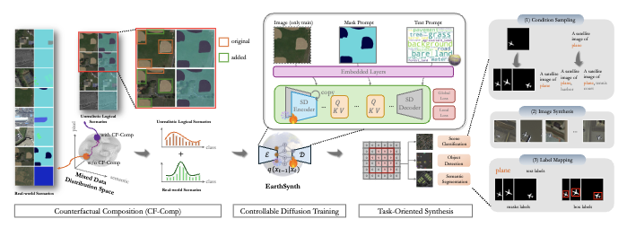

<p align="center">
    
</p>
<div align="center">
<h1 align="center"> EarthSynth: Generating Informative Earth Observation with Diffusion Models</h1>

<h4 align="center"><em>Jiancheng Pan*,     Shiye Lei*,     Yuqian Fu✉,    Jiahao Li,    Yanxing Liu</em></h4>

<h4 align="center"><em>Xiao He,   Yuze Sun,  Long Peng,   Xiaomeng Huang✉ ,     Bo Zhao✉ </em></h4> 
<p align="center">
    
</p>

\* *Equal Contribution* &nbsp; &nbsp; Corresponding Author ✉

</div>

<p align="center">
    <a href="https://arxiv.org/abs/2505.12108"></a>
    <!-- <a href="http://arxiv.org/abs/2408.09110"></a> -->
    <a href="https://jianchengpan.space/EarthSynth-website/index.html">"></a>
    <a href="https://huggingface.co/datasets/jaychempan/EarthSynth-180K"></a>
    <a href="https://huggingface.co/jaychempan/EarthSynth"></a>
    <a href="https://github.com/jaychempan/EarthSynth/blob/main/LICENSE"></a>
</p>

<p align="center">
  <a href="#news">News</a> |
  <a href="#abstract">Abstract</a> |
  <a href="#dataset">Dataset</a> |
  <a href="#model">Model</a> |
  <a href="#statement">Statement</a>
</p>

## Examples

<div align="center">
<p>A satellite image of <span style="color:inherit;">road</span>.</p>
  
  
  
  
  
</div>
<div align="center">
<p>A satellite image of <span style="color:inherit;">small vehicle</span>.</p>
  
  
  
  
  
</div>
<div align="center">
<p>A satellite image of <span style="color:inherit;">tree</span>. (Flood)</p>
  
  
  
  
  
</div>
<div align="center">
<p>A satellite image of <span style="color:inherit;">water</span>.</p>
  
  
  
  
  
</div>
<div align="center">
<p>A satellite image of <span style="color:inherit;">baseball diamond, vehicle</span>.</p>
  
  
  
  
  
</div>

## TODO

- [ ] Release EarthSynth Models to 🤗 HuggingFace
- [x] Release EarthSynth-180K Dataset to 🤗 HuggingFace

## News
- [2025/8/7] EarthSynth-180K dataset is uploaded to 🤗 [HuggingFace](https://huggingface.co/datasets/jaychempan/EarthSynth-180K).
- [2025/5/20] Our paper of "EarthSynth: Generating Informative Earth Observation with Diffusion Models" is up on [arXiv](https://arxiv.org/abs/2505.12108).


## Abstract

Remote sensing image (RSI) interpretation typically faces challenges due to the scarcity of labeled data, which limits the performance of RSI interpretation tasks. To tackle this challenge, we propose **EarthSynth**, a diffusion-based generative foundation model that enables synthesizing multi-category, cross-satellite labeled Earth observation for downstream RSI interpretation tasks. To the best of our knowledge, EarthSynth is the first to explore multi-task generation for remote sensing, tackling the challenge of limited generalization in task-oriented synthesis for RSI interpretation. EarthSynth, trained on the EarthSynth-180K dataset, employs the Counterfactual Composition training strategy with a three-dimensional batch-sample selection mechanism to improve training data diversity and enhance category control. Furthermore, a rule-based method of R-Filter is proposed to filter more informative synthetic data for downstream tasks. We evaluate our EarthSynth on scene classification, object detection, and semantic segmentation in open-world scenarios. There are significant improvements in open-vocabulary understanding tasks, offering a practical solution for advancing RSI interpretation.

<p align="center">
    
</p>

## Dataset
EarthSynth-180K is derived from OEM, LoveDA, DeepGlobe, SAMRS, and LAE-1M datasets. It is further enhanced with mask and text prompt conditions, making it suitable for training foundation diffusion-based generative model. The EarthSynth-180K dataset is constructed using the Random Cropping and Category Augmentation strategies.

<p align="center">
    
</p>


<p align="center">
    
</p>

### Data Preparation 
We use category augmentation on each image to help the model better understand each category and allow more control over specific categories when generating images. This also helps improve the combination of samples in the batch-based CF-Comp strategy. If you want to train a remote sensing foundation generative model of your own, this step is not necessary. Here is the use of the category-augmentation method.

- Merge the split zip files and extract them
```
cat train.zip_part_* > train.zip
unzip train.zip
```
- Store the dataset in the following directory structure: `./data/EarthSynth-180K`
```
.(./data/EarthSynth-180K)
└── train
    ├── images
    └── masks
```
- Run the category augmentation script:
```
python category-augmentation.py
```
After running, the directory will look like this:
```
..(./data/EarthSynth-180K)
└── train
    ├── category_images  # Augmented single-category images
    ├── category_masks   # Augmented single-category masks
    ├── images
    ├── masks
    └── train.jsonl      # JSONL file for training
```

## Model
### Environment Setup
The experimental environment is based on [`diffusers==0.30.3`](https://huggingface.co/docs/diffusers/v0.30.3/en/installation), and the installation environment references mmdetection's installation guide. You can refer to my environment `requirements.txt` if you encounter problems.
```
conda create -n earthsy python=3.8 -y
conda activate earthsy
pip install -r requirements.txt
git clone https://github.com/jaychempan/EarthSynth.git
cd diffusers
pip install -e ".[torch]"
```
### EarthSynth with CF-Comp
EarthSynth is trained with CF-Comp training strategy on real and unrealistic logical mixed data distribution, learns remote sensing pixel-level properties in multiple dimensions, and builds a unified process for conditional diffusion training and synthesis.

<p align="center">
    
</p>

### Train EarthSynth
This project is based on diffusers' ControlNet base structure, and the community is open for easy use and promotion. By modifying the config file of `train.sh` of the catalog `./diffusers/train/`.

```
cd diffusers/
bash train/train.sh
```

### Inference
Example inference using 🤗 HuggingFace pipeline:
```python
from diffusers import StableDiffusionControlNetPipeline, ControlNetModel
import torch
from PIL import Image

img = Image.open("./demo/control/mask.png")

controlnet = ControlNetModel.from_pretrained("jaychempan/EarthSynth")

pipe = StableDiffusionControlNetPipeline.from_pretrained("stable-diffusion-v1-5/stable-diffusion-v1-5", controlnet=controlnet)
pipe = pipe.to("cuda:0")

# generate image
generator = torch.manual_seed(10345340)
image = pipe(
    "A satellite image of a storage tank",
    generator=generator,
    image=img,
).images[0]

image.save("generated_storage_tank.png")

```
Or you can infer locally:
```
python test.py --base_model path/to/stable-diffusion/ --controlnet_path path/to/earthsynth [--control_image_dir] [--output_dir] [--output_dir] [--category_txt_path] [--num_images]
```
### Training Data Generation

<p align="center">
    
</p>


### Acknowledgement

This project references and uses the following open-source models and datasets.

#### Related Open Source Models

- [Diffusers](https://github.com/huggingface/diffusers)
- [ControlNet](https://github.com/lllyasviel/ControlNet)
- [MM-Grounding-DINO](https://github.com/open-mmlab/mmdetection/blob/main/configs/mm_grounding_dino/README.md)
- [CLIP](https://github.com/openai/CLIP)
- [GSNet](https://github.com/yecy749/GSNet)

#### Related Open Source Datasets

- [OpenEarthMap](https://open-earth-map.org/overview_oem.html)
- [LoveDA](https://github.com/Junjue-Wang/LoveDA?tab=readme-ov-file)
- [DeepGlobe](http://deepglobe.org/)
- [SAMRS](https://github.com/ViTAE-Transformer/SAMRS)
- [LAE-1M](https://github.com/jaychempan/LAE-DINO)

### Citation

If you are interested in the following work or want to use our dataset, please cite the following paper.

```
@misc{pan2025earthsynthgeneratinginformativeearth,
title={EarthSynth: Generating Informative Earth Observation with Diffusion Models}, 
author={Jiancheng Pan and Shiye Lei and Yuqian Fu and Jiahao Li and Yanxing Liu and Yuze Sun and Xiao He and Long Peng and Xiaomeng Huang and Bo Zhao},
year={2025},
eprint={2505.12108},
archivePrefix={arXiv},
primaryClass={cs.CV},
url={https://arxiv.org/abs/2505.12108}, 
} 
```
