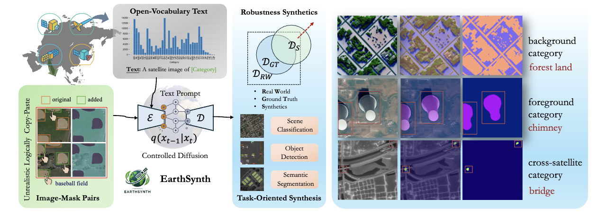

    

<h1 align="center"> EarthSynth: Generating Informative Earth Observation with Diffusion Models</h1>

<!-- <h4 align="center"><em>Jiancheng Pan*,     Yanxing Liu*,     Yuqian Fu✉,     Muyuan Ma,</em></h4>

<h4 align="center"><em>Jiahao Li,     Danda Pani Paudel,    Luc Van Gool,     Xiaomeng Huang✉ </em></h4> -->
<!-- 

    

 -->

<!-- \* *Equal Contribution* &nbsp; &nbsp; Corresponding Author ✉ -->

    
    <!--  -->
    <a href="https://jianchengpan.space/EarthSynth-website/index.html">"></a>
    

  <a href="#news">News</a> |
  <a href="#abstract">Abstract</a> |
  <a href="#dataset">Dataset</a> |
  <a href="#model">Model</a> |
  <a href="#statement">Statement</a>

<!-- ## TODO

- [X] Release LAE-Label Engine
- [X] Release LAE-1M Dataset
- [ ] Release LAE-DINO Model -->

## News
- [2025/5/6] Our paper of "EarthSynth: Generating Informative Earth Observation with Diffusion Models" is up on [arXiv](http://arxiv.org/abs/2408.09110).

## Abstract

Remote sensing image interpretation often faces challenges due to the scarcity of labeled data, which limits the performance of deep learning models in visual understanding tasks. We propose EarthSynth, a conditional foundation diffusion model that enables synthesizing multi-category, cross-satellite labeled Earth observations for downstream visual understanding tasks. EarthSynth introduces a logically coherent scene synthesis strategy to enhance data diversity and explore robustness diffusion-based generation. Additionally, we investigate the probabilistic relationships between object foreground and background to improve remote sensing image understanding. Our work encompasses semantic-level scene selection, instance-level constrained scene synthesis, and data annotation generation strategies, offering a practical and scalable solution for advancing remote sensing image analysis through data augmentation and synthetic labeling.

    

