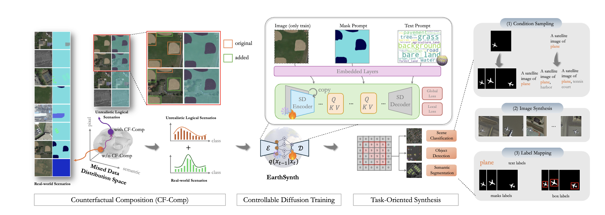

<p align="center">
    
</p>
<div align="center">
<h1 align="center"> EarthSynth: Generating Informative Earth Observation with Diffusion Models</h1>

<h4 align="center"><em>Jiancheng Pan*,     Shiye Lei*,     Yuqian Fu✉,    Jiahao Li,    Yanxing Liu</em></h4>

<h4 align="center"><em>Xiao He,   Yuze Sun,  Long Peng,   Xiaomeng Huang✉ ,     Bo Zhao✉ </em></h4> 
<p align="center">
    
</p>

\* *Equal Contribution* &nbsp; &nbsp; Corresponding Author ✉

</div>

<p align="center">
    <a href="https://arxiv.org/abs/2505.12108"></a>
    <!-- <a href="http://arxiv.org/abs/2408.09110"></a> -->
    <a href="https://jianchengpan.space/EarthSynth-website/index.html">"></a>
    <a href="https://github.com/jaychempan/EarthSynth/blob/main/LICENSE"></a>
</p>

<p align="center">
  <a href="#news">News</a> |
  <a href="#abstract">Abstract</a> |
  <a href="#dataset">Dataset</a> |
  <a href="#model">Model</a> |
  <a href="#statement">Statement</a>
</p>

<!-- ## TODO

- [X] Release LAE-Label Engine
- [X] Release LAE-1M Dataset
- [ ] Release LAE-DINO Model -->

## News
- [2025/5/20] Our paper of "EarthSynth: Generating Informative Earth Observation with Diffusion Models" is up on [arXiv](https://arxiv.org/abs/2505.12108).

## Abstract

Remote sensing image (RSI) interpretation typically faces challenges due to the scarcity of labeled data, which limits the performance of RSI interpretation tasks. To tackle this challenge, we propose EarthSynth, a diffusion-based generative foundation model that enables synthesizing multi-category, cross-satellite labeled Earth observation for downstream RSI interpretation tasks. To the best of our knowledge, EarthSynth is the first to explore multi-task generation for remote sensing. EarthSynth, trained on the EarthSynth-180K dataset, employs the Counterfactual Composition training strategy to improve training data diversity and enhance category control. Furthermore, a rule-based method of R-Filter is proposed to filter more informative synthetic data for downstream tasks. We evaluate our EarthSynth on scene classification, object detection, and semantic segmentation in open-world scenarios, offering a practical solution for advancing RSI interpretation.

<p align="center">
    
</p>

## Dataset
EarthSynth-180K is derived from OEM, LoveDA, DeepGlobe, SAMRS, and LAE-1M datasets. It is further enhanced with mask and text prompt conditions, making it suitable for training foundation diffusion-based generative model. The EarthSynth-180K dataset is constructed using the Random Cropping and Category Augmentation strategies.

<p align="center">
    
</p>


<p align="center">
    
</p>

## Model
EarthSynth is trained with CF-Comp training strategy on real and unrealistic logical mixed data distribution, learns remote sensing pixel-level properties in multiple dimensions, and builds a unified process for conditional diffusion training and synthesis.

<p align="center">
    
</p>

### Acknowledgement

This project references and uses the following open source models and datasets.

#### Related Open Source Models

- [Diffusers](https://github.com/huggingface/diffusers)
- [ControlNet](https://github.com/lllyasviel/ControlNet)
- [MM-Grounding-DINO](https://github.com/open-mmlab/mmdetection/blob/main/configs/mm_grounding_dino/README.md)
- [CLIP](https://github.com/openai/CLIP)
- [GSNet](https://github.com/yecy749/GSNet)

#### Related Open Source Datasets

- [OpenEarthMap](https://open-earth-map.org/overview_oem.html)
- [LoveDA](https://github.com/Junjue-Wang/LoveDA?tab=readme-ov-file)
- [DeepGlobe](http://deepglobe.org/)
- [SAMRS](https://github.com/ViTAE-Transformer/SAMRS)
- [LAE-1M](https://github.com/jaychempan/LAE-DINO)

### Citation

If you are interested in the following work, please cite the following paper.

```
@misc{pan2025earthsynthgeneratinginformativeearth,
title={EarthSynth: Generating Informative Earth Observation with Diffusion Models}, 
author={Jiancheng Pan and Shiye Lei and Yuqian Fu and Jiahao Li and Yanxing Liu and Yuze Sun and Xiao He and Long Peng and Xiaomeng Huang and Bo Zhao},
year={2025},
eprint={2505.12108},
archivePrefix={arXiv},
primaryClass={cs.CV},
url={https://arxiv.org/abs/2505.12108}, 
} 
```